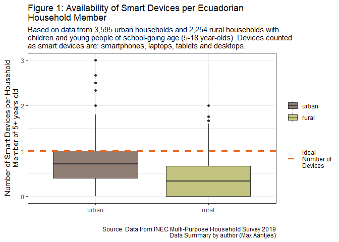
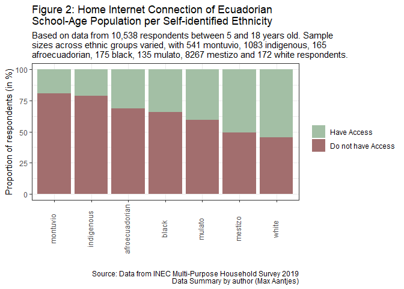
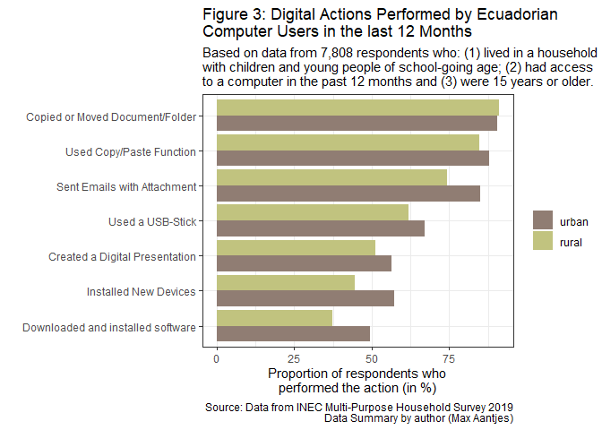

Appendix
================
Max Aantjes
22/08/2020

  - [Introduction](#introduction)
  - [R Packages](#r-packages)
  - [Data Extraction](#data-extraction)
      - [Data Source and Relevance](#data-source-and-relevance)
      - [Download](#download)
  - [Data Cleaning](#data-cleaning)
      - [Removal of Missing Values](#removal-of-missing-values)
      - [Specification of Variable
        Classes](#specification-of-variable-classes)
      - [Merge of the Two Data Sets](#merge-of-the-two-data-sets)
      - [Subset of the Data of
        Interest](#subset-of-the-data-of-interest)
  - [Analysis](#analysis)
      - [Availability of Smart Devices](#availability-of-smart-devices)
      - [Access to Internet](#access-to-internet)
      - [Digital Literacy](#digital-literacy)
  - [References](#references)

# Introduction

The following sections contain all computations for the creation of the
exploratory data results summarised in the brief paper. Computations are
accompanied by references and justifications to clarify any choices
made. Through *code book tables*, explicit references are also made to
the survey questions which responses were used in the analysis.

# R Packages

The following R packages are used in the subsequent code sections.

``` r
library(tidyverse)
library(knitr)
library(ggplot2)
```

# Data Extraction

### Data Source and Relevance

The analysis performed below is based on the results of the Ecuadorian
National Multi-Purpose Household Survey of December 2019 (Encuesta
Nacional Multipropósito de Hogares - Diciembre 2019). The survey
collected data for a variety of socio-economic indicators and was
conducted by the Ecuadorian national census and statistics institute,
INEC. At the time of writing, the form and raw data are available in
this [online
repository](https://www.ecuadorencifras.gob.ec/encuesta-nacional-multiproposito-de-hogares/).
According to INEC, the data is representative at national,
national-rural and national-urban level. A total of 11,528 households
were surveyed, with the sampling design taking the form of randomised
cluster sampling.

Supplementary information on the data collection process and the
definition of some variables has been made available by INEC (Andrade et
al., 2020). An example of an important variable defined in that document
is the distinction between rural areas, i.e. population centres of less
than 2,000 citizens, viz. urban areas, i.e. population centres of 2000
citizens or more (ibid, p. 11). All other interpretations of variables
are directly taken from the form used during the survey process (INEC,
2019).

### Download

The following code is used to extract the data from the data repository.

``` r
url <- "https://www.ecuadorencifras.gob.ec/documentos/web-inec/Multiproposito/2019/BDD_DATOS_ABIERTOS_MULTI%20_2019_12_CSV.zip"
download.file(url, "temp.zip")
unzip("temp.zip")
dfhousehold <- read.csv("BDD_DATOS_ABIERTOS_MULTI _2019_12_CSV//201912_multibdd_equipamiento.sav.csv", sep = ";")
dfperson <-  read.csv("BDD_DATOS_ABIERTOS_MULTI _2019_12_CSV//201912_multibdd_personas.sav.csv", sep = ";")
unlink("BDD_DATOS_ABIERTOS_MULTI _2019_12_CSV", recursive = TRUE)
file.remove("temp.zip")
```

# Data Cleaning

### Removal of Missing Values

Missing values are not removed at this stage. The questions in the
survey were constructed in a hierarchical manner, where answers to
earlier questions can make later questions redundant. Follow-up
questions (such as for example: do you own a smartphone?) were not asked
if the respondent answered “no” to a preceding question (such as for
example: do you own a phone?). For this reason, missing values do
**not** necessarily indicate missing information. Accordingly, missing
values are interpreted, adapted and potentially removed on a case by
case basis.

### Specification of Variable Classes

First the classes of the categorical variables which are used for
grouping and identification are specified. The relevant variables are
first summarised in *Code Book Table 1*:

| Code      | Form Section          | Question                                                                                                                     | Responses                                                                                                 |
| :-------- | :-------------------- | :--------------------------------------------------------------------------------------------------------------------------- | :-------------------------------------------------------------------------------------------------------- |
| id\_per   | \-                    | Identification code for person assigned by INEC                                                                              | string of characters (numbers)                                                                            |
| id\_hogar | \-                    | Identification code for household assigned by INEC                                                                           | string of characters (numbers)                                                                            |
| area      | \-                    | Determined by Interviewer                                                                                                    | 1 = urban, 2 = rural                                                                                      |
| s1p9      | Section 1, question 9 | How do you identify yourself according to your culture and customs (¿Cómo se identifica (…) según su cultura y costumbres:?) | 1 =indigenous, 2 = afroecuadorian, 3 = black, 4 = mulato, 5 = montuvio, 6 = mestizo, 7 = white, 8 = other |
| s1p3      | Section 1, question 3 | How old are you? ¿Cuántos años cumplidos tiene (…)?                                                                          | 0 = less than 1 year old, 1 = 1 year old, etc.                                                            |

Code Book Table 1

The subsequent code transforms each of these variables into factor
variables in line with *Code Book Table 1*.

``` r
dfperson <- dfperson %>%
        rename("area" = 1) %>%
        mutate(id_per = as.character(id_per)) %>%
        mutate(id_hogar = as.character(id_hogar)) %>%
        mutate(area = factor(area, levels = 1:2, labels = c("urban", "rural"))) %>%
        mutate(eth = factor(s1p9, levels = 1:8, labels = c("indigenous", "afroecuadorian", "black", "mulato", 
                                                           "montuvio", "mestizo", "white", "other")))
        
dfhousehold <- dfhousehold %>%
        mutate(id_hogar = as.character(id_hogar))
```

There were no missing values recorded in terms of these four variables,
apart from the `eth` variable.

``` r
sapply(list(is.na(dfhousehold$id_hogar), is.na(dfperson$id_per), is.na(dfperson$id_hogar), 
            is.na(dfperson$area), is.na(dfperson$eth)), sum)
```

    ## [1]    0    0    0    0 2690

The 2,690 missing values in the `eth` variable were all recorded with
0-4 year-olds. Since these respondents are not of school-going age nor
likely compete for resources such as electronic devices needed by the
school-going population, they are not of relevance to the data analysis.
Accordingly, this age group will later be removed from the data set.

``` r
unique(dfperson$s1p3[is.na(dfperson$eth)])
```

    ## [1] 4 2 0 3 1

### Merge of the Two Data Sets

The information on household level and person level can now be merged
using the *id\_hogar* variable.

``` r
df <- dfperson %>%
        left_join(dfhousehold, by = "id_hogar") 
```

### Subset of the Data of Interest

Only households with children or young people of schoolgoing age (5 - 18
year-olds) are relevant to this analysis. For this purpose, a subset is
taken from the data. The `agecheck()` function checks if there is at
least one household member who is between 5 and 18 years old, returning
value 1, or not, returning value 0.

``` r
agecheck <- function(x){
        y <- 0
        for(i in 1:length(x)){
                if(x[i] %in% 5:18){
                        y <-1}}
        return(y)}
```

The households identification numbers of household where the
`agecheck()` function returns 1 are then stored in the `subset` data
frame.

``` r
subset <- df %>%
        group_by(id_hogar) %>%
        summarise(subset = agecheck(s1p3)) %>%
        select(id_hogar, subset)
```

A subset of the households of interest is taken from the `df` data
frame. For reasons explained above, any respondents between 0 and 4
years old are also removed from the data set.

``` r
df <- df %>%
        left_join(subset, by = "id_hogar") %>%
        filter(subset == 1) %>%
        filter(s1p3 > 4) %>%
        select(-subset)
```

# Analysis

### Availability of Smart Devices

#### Code Book

The first graph aims to estimate the relative risk of exclusion from
education based on the average number of electronic devices per
household member. This graph relies on 7 different variables summarised
in *Code Book Table 2*:

| Code    | Form Section                                              | Question                                                                                                                                                                                       | Responses       |
| :------ | :-------------------------------------------------------- | :--------------------------------------------------------------------------------------------------------------------------------------------------------------------------------------------- | :-------------- |
| s7p1a   | section 7, question 1, subsection 1                       | Do you have an activated phone? (¿(…) tiene teléfono celular activado?)                                                                                                                        | 1 = yes, 2 = no |
| s7p1b   | section 7, question 1, subsection 2                       | How many activated phones do you have? (¿Cuántos?)                                                                                                                                             | numeric         |
| s7p1a1  | section 7, question 1A                                    | Is your phone a smartphone? (¿El (los) teléfono (s) celular (es) que tiene (…..) es/son smartphone (teléfono Inteligente, se puede comunicar a través de Wi-Fi, e-mails, red de datos, etc.)?) | 1 = yes, 2 = no |
| s11p11a | Section 11, Question 1, subsection 1, subsection ‘code’   | Does the household have a desktop computer? (¿Tiene este hogar: computadora de escritorio?)                                                                                                    | 1 = yes, 2 = no |
| s11p11b | Section 11, Question 1, subsection 1, subsection ‘number’ | How many desktop computers does the household have? (¿Cuántos tiene?)                                                                                                                          | numeric         |
| s11p12a | Section 11, question 1, subsection 2, subsection ‘code’   | Does the household have a laptop or tablet? (¿Tiene este hogar: computadora laptop/ tablet?)                                                                                                   | 1 = yes, 2 = no |
| s11p12b | section 11, question 1, subsection 2, subsection ‘number’ | How many laptops and tablets does the household have? (¿Cuántos tiene?)                                                                                                                        | numeric         |

Code Book Table 2

#### Number of Smartphones per Household

The code first assigns the value 0 to variable *s7p1b* (the number of
phones the respondent has) if *s7p1a* equals 2 (which means the
respondent does not own any activated phone). In other cases the value
of *s7p1b* is not changed. There were no missing values in variable
*s7p1a* nor in *s7p1b*.

``` r
df1 <- df
df1$s7p1b[df1$s7p1a == 2] <- 0
sapply(list(is.na(df1$s7p1b),is.na(df1$s7p1a)), sum)
```

    ## [1] 0 0

Next, the code replaces the following values of variable *s7p1a1*: value
2 (which means the respondent’s phone(s) is/are **not** smartphone(s))
is replaced with 0; value 1 (which means the respondent’s phone(s)
is/are smartphone(s)) remains 1. For rows where *s7p1b* equals 0 (which
means the respondent does not own any activated phones), the value of
*s7p1a1* is also set to 0 (which means the respondent does not own any
smartphones). There were no missing values in variable *s7p1a1*.

``` r
df1$s7p1a1 <- ifelse(df1$s7p1a1 == 1, 1, 0)
df1$s7p1a1[df1$s7p1b == 0] <- 0
sum(is.na(df1$s7p1a1))
```

    ## [1] 0

Following these operations, the number of smartphones per individual can
now be calculated by multiplying *s7p1b* (which indicates the number of
activated phones) with *s7p1a1* (which indicates if the respondent’s
phone(s) is/are smartphone(s)). Finally, the number of smartphones is
summed per household using the *id\_hogar* variable. The results are
stored in the `dfphone` data set.

``` r
dfphone <- df1 %>%
        mutate(phone = s7p1b * s7p1a1) %>%
        group_by(id_hogar) %>%
        summarise(no.smartphones = sum(phone))
```

#### Number of computers, laptops and tablets per household

The following code creates a data frame listing the number of computers,
laptops and tablets per household. It first sets the value of variable
*s11p11b* (the number of desktop computers) to 0 if *s11p11a* equals 2
(which means the household does not have a desktop computer). There were
no missing values in variable *s11p11a* nor in *s11p11b*.

``` r
df1$s11p11b[df1$s11p11a == 2] <- 0
sapply(list(is.na(df1$s11p11ab),is.na(df1$s11p11b)), sum)
```

    ## [1] 0 0

Next, the code sets the value of variable *s11p12b* (the number of
tablets and laptops) to 0 if *sp11p12a* equals 2 (which means the
household does not have a tablet nor laptop). There were no missing
values in variable *s11p12a* nor in *s11p12b*.

``` r
df1$s11p12b[df1$s11p12a == 2] <- 0
sapply(list(is.na(df1$s11p12ab),is.na(df1$s11p12b)), sum)
```

    ## [1] 0 0

Finally, variables *s11p11b* (the number of desktop computers) and
variable *s11p12b* (the number of laptops and tablets) are summed into
the *no.computers* variable. The duplicate values for each household
(which exist because we have calculated the household value for each
household member) are then removed. The results are stored in the
`dfcomputer` data set.

``` r
dfcomputer <- df1 %>%
        mutate(no.computers = s11p11b + s11p12b) %>%
        select(id_hogar, no.computers) %>%
        distinct()
```

#### Number of Devices per Household Member

The following code creates a data set, `dfmember` which indicates for
each household the number of members of age 5 and older.

``` r
dfmember <- df1 %>%
        count(id_hogar)
```

The following code creates a data set, `dfarea` which indicates the area
per household.

``` r
dfarea <- df1 %>%
        select(id_hogar, area) %>%
        distinct()
```

The following code calculates for each household how many electronic
devices are available for each of its 5+ year-old members. For this
purpose, the dfcomputer and dfphone data sets are first merged through
the *id\_hogar* variable. The variables *computer* (which indicates the
number of desktop computers, laptops and tablets in the household) and
the variable *phone* (which indicates the number of smartphones in the
household) are subsequently summed into the variable *no.devices*.

Next, the code merges the resulting data set with the dfmember data set
through the *id\_hogar* variable. The number of devices per household
member are then calculated by dividing the *no.devices* (which indicates
the total number of electronic devices) with *n* (which indicates the
number of household members). The results are stored in the *ratio*
variable. The area is then matched with households by merging the data
set with the `dfarea` data set.

``` r
dfdevices <- dfcomputer %>%
        left_join(dfphone, by = "id_hogar") %>%
        mutate(no.devices = no.computers + no.smartphones) %>%
        left_join(dfmember, by = "id_hogar") %>%
        mutate(ratio = no.devices/n) %>%
        left_join(dfarea, by = "id_hogar")
```

We can now calculate the mean, median and standard deviation values of
the *ratio* variable for rural and urban areas.

``` r
dfdevices %>%
  group_by(area) %>%
  summarise(mean(ratio), median(ratio), sd(ratio))
```

    ## # A tibble: 2 x 4
    ##   area  `mean(ratio)` `median(ratio)` `sd(ratio)`
    ##   <fct>         <dbl>           <dbl>       <dbl>
    ## 1 urban         0.736           0.714       0.462
    ## 2 rural         0.405           0.333       0.391

We can also calculate the number of households surveyed per area. There
were 3,595 urban households and 2,254 rural households.

``` r
summary(dfarea$area)
```

    ## urban rural 
    ##  3595  2254

Finally, a graph is created which compares the distribution of device
availability across urban and rural regions. 1 outlier is removed from
the graph for readability purposes.

``` r
p <- ggplot() + theme_bw()
p1 <- p + geom_boxplot(data = dfdevices, aes(y = ratio, x = area, fill = area)) + ylim(0,3)
p2 <- p1 + geom_hline(aes(yintercept = 1, col = "Ideal\nNumber of\nDevices"), size = 1.2, lty = "dashed") 
p3 <- p2 + labs(y = "Number of Smart Devices per Household\nMember of 5+ years old", x = "", 
                title = "Figure 1: Availability of Smart Devices per Ecuadorian\nHousehold Member", 
                subtitle = "Based on data from 3,595 urban households and 2,254 rural households with\nchildren and young people of school-going age (5-18 year-olds). Devices counted\nas smart devices are: smartphones, laptops, tablets and desktops.", 
                caption = "Source: Data from INEC Multi-Purpose Household Survey 2019\nData Summary by author (Max Aantjes)", fill = "")
p4 <- p3 + scale_color_manual(name = "", values = c("Ideal\nNumber of\nDevices" = "#E96519")) + scale_fill_manual(name = "", values = c("urban" = "#907D73", "rural" = "#C1C37F"))
p4
```

    ## Warning: Removed 1 rows containing non-finite values (stat_boxplot).

<!-- -->

### Access to Internet

#### Code Book

The second graph aims to estimate the relative risk of exclusion from
education based on the access to internet in households. This graph
relies on 1 variable summarised in *Code Book Table 3*:

| Variable | Form Section           | Question                                                                           | Responses       |
| :------- | :--------------------- | :--------------------------------------------------------------------------------- | :-------------- |
| s11p2    | Section 11, question 2 | Does the household have access to internet? (¿Tiene este hogar acceso a internet?) | 1 = yes, 2 = no |

Code Book Table 3

#### Learner Access to Internet at Home

The variable of interest is first converted into a factor variable in
line with *Code Book Table 3*. There are no missing values in the data
frame.

``` r
df1 <- df %>%
        mutate(s11p2 = factor(s11p2, levels = 1:2, labels = c("Have Access", "Do not have Access"))) 
sum(is.na(df$s11p2))
```

    ## [1] 0

A subset of the respondents aged 5 to 18 years old is then taken from
the data set. The subset contains responses from 1083 indigenous, 165
afroecuadorian, 175 black, 135 mulato, 541 montuvio, 8267 mestizo, 172
white and 5 ‘other’ respondents. Without ‘other’, the resulting data set
has 10,538 respondents.

``` r
df2 <- df1 %>%
        filter(s1p3 %in% 5:18)
summary(df2$eth)
```

    ##     indigenous afroecuadorian          black         mulato       montuvio 
    ##           1083            165            175            135            541 
    ##        mestizo          white          other 
    ##           8267            172              5

``` r
nrow(df2) - 5
```

    ## [1] 10538

Subsequently, the proportions of respondents with and without access to
the internet are calculated for each ethnic group. This is saved in a
new data frame, `dfacc`. The ethnic group, ‘other’, is removed due to
the small sample size (\<6). Each ethnic group is then assigned a rank
in accordance with the proportion of respondents having access to
internet.

``` r
dfacc <- df2 %>%
        filter(eth != "other") %>%
        group_by(eth, s11p2) %>%
        count() %>%
        ungroup() %>%
        group_by(eth) %>%
        mutate(prop = n/sum(n)*100)

order <- dfacc %>%
        filter(s11p2 == "Have Access") %>%
        arrange(prop) %>%
        rowid_to_column("rank") %>%
        select(eth, rank)

dfacc <- dfacc %>%
        left_join(order, by = "eth")
```

The results are listed in *table 1*.

| eth            | prop\_Have Access | prop\_Do not have Access | n\_Have Access | n\_Do not have Access |
| :------------- | :---------------- | :----------------------- | -------------: | --------------------: |
| montuvio       | 19%               | 81%                      |            105 |                   436 |
| indigenous     | 21%               | 79%                      |            230 |                   853 |
| afroecuadorian | 32%               | 68%                      |             52 |                   113 |
| black          | 34%               | 66%                      |             60 |                   115 |
| mulato         | 41%               | 59%                      |             55 |                    80 |
| mestizo        | 51%               | 49%                      |           4209 |                  4058 |
| white          | 55%               | 45%                      |             94 |                    78 |

Table 1: Home Internet Access per Ethnic group

Finally, a stacked bar chart is created which compares the proportions
in terms of different ethnic groups.

``` r
p <- ggplot(data = dfacc, aes(y = prop, x = reorder(eth, rank), fill = s11p2)) + theme_bw()
p1 <- p + geom_bar(position = "stack", stat = "identity") 
p2 <- p1 + labs(y = "Proportion of respondents (in %)", x = "", 
                title = "Figure 2: Home Internet Connection of Ecuadorian\nSchool-Age Population per Self-identified Ethnicity", 
                subtitle = "Based on data from 10,538 respondents between 5 and 18 years old. Sample\nsizes across ethnic groups varied, with 541 montuvio, 1083 indigenous, 165\nafroecuadorian, 175 black, 135 mulato, 8267 mestizo and 172 white respondents.", 
                caption = "Source: Data from INEC Multi-Purpose Household Survey 2019\nData Summary by author (Max Aantjes)", fill = "") + 
        theme(axis.text.x = element_text(angle = 90, vjust = 0.2))
p3 <- p2 + scale_fill_manual(name = "", values = (c("Have Access" = "#A3BFA5", "Do not have Access" = "#A26E6E")))
p3
```

<!-- -->

### Digital Literacy

#### Code Book

The third graph aims to estimate the relative risk of exclusion from
education based on the digital literacy of computer users. This graph
relies on 7 variables summarised in *Code Book Table 4*:

| Code  | Form Section                        | Question                                                                                                                                                 | Responses                                        |
| :---- | :---------------------------------- | :------------------------------------------------------------------------------------------------------------------------------------------------------- | :----------------------------------------------- |
| s7p6  | Section 7, Question 6               | Have you used a computer from anywhere in the past 12 months?                                                                                            | 1 = yes, 2 = no                                  |
| s7p71 | Section 7, question 7, subsection 1 | In the past 12 months when using a computer or laptop: have you copied or moved a document or folder?                                                    | 1 = yes, 2 = no, 99 = does not know or no answer |
| s7p72 | Section 7, question 7, subsection 2 | In the past 12 months when using a computer or laptop: have you used the copy and paste function in a document?                                          | 1 = yes, 2 = no, 99 = does not know or no answer |
| s7p73 | Section 7, question 7, subsection 3 | In the past 12 months when using a computer or laptop: have you sent an email with an attachment?                                                        | 1 = yes, 2 = no, 99 = does not know or no answer |
| s7p75 | Section 7, question 7, subsection 5 | In the past 12 months when using a computer or laptop: have you installed a new device (hardware)?                                                       | 1 = yes, 2 = no, 99 = does not know or no answer |
| s7p76 | Section 7, question 7, subsection 6 | In the past 12 months when using a computer or laptop: have you searched for, downloaded, installed and configured software?                             | 1 = yes, 2 = no, 99 = does not know or no answer |
| s7p78 | Section 7, question 7, subsection 7 | In the past 12 months when using a computer or laptop: have you created a digital presentation such as powerpoint, prezi or slideshare?                  | 1 = yes, 2 = no, 99 = does not know or no answer |
| s7p79 | Section 7, question 7, subsection 8 | In the past 12 months when using a computer or laptop: have you transferred folders between devices through the use of other devices such as USB-sticks? | 1 = yes, 2 = no, 99 = does not know or no answer |

Code Book Table 4

#### Digital Literacy of Members of Households with Learners

First, a subset of the data frame needs to be taken with respondents who
(i) used a computer and (ii) are over the age of 14. In other cases, the
digital literacy questions listed in the codebook were **not** asked.

``` r
df1 <- df %>%
  filter(s7p6 == 1 & s1p3 > 14)
```

Next, the table is pivoted (long) and appropriate names are given to the
performed operations listed in the codebook. The responses for each
performed operation are stored in the *Value* variable. The assumption
is made that if respondents answered “I don’t know” to a question, then
they did *not* perform that action. This is a reasonable assumption, as
they plausibly would understand the question if they had performed the
operation in the past.

``` r
df2 <- df1 %>%
  select(id_per, area, "Copied or Moved Document/Folder" = s7p71, "Used Copy/Paste Function"= s7p72, 
         "Sent Emails with Attachment" = s7p73, "Installed New Devices" = s7p75, 
         "Downloaded and installed software" = s7p76,"Created a Digital Presentation" = s7p77, 
         "Used a USB-Stick" = s7p78) %>%
  pivot_longer(-c(id_per, area), names_to = "Action", values_to = "Value") %>%
  mutate(Value = factor(Value, levels = c(1,2,99), labels = c("yes", "no", "no"))) %>%
  mutate(Action = factor(Action))
```

The subsequent code calculates the proportion of respondents which
performed different operations for rural and urban areas. The mean of
the urban and rural proportion of respondents who performed a certain
operation is used to order the operations.

``` r
df3 <- df2 %>%
  group_by(area, Action, Value) %>%
  count() %>%
  ungroup() %>%
  group_by(area, Action) %>%
  mutate(prop = n/sum(n)*100) %>%
  filter(Value == "yes") %>%
  ungroup() %>%
  group_by(Action) %>%
  mutate(order = mean(prop))
```

The results are listed in *table 2*.

| Action                            | urban | rural |
| :-------------------------------- | :---- | :---- |
| Copied or Moved Document/Folder   | 91%   | 91%   |
| Used Copy/Paste Function          | 88%   | 85%   |
| Sent Emails with Attachment       | 85%   | 74%   |
| Used a USB-Stick                  | 67%   | 62%   |
| Created a Digital Presentation    | 56%   | 51%   |
| Installed New Devices             | 57%   | 45%   |
| Downloaded and installed software | 50%   | 37%   |

Table 2: Digital Actions Performed per Area

Finally, a flipped bar chart is created which compares the proportions
in terms of rural and urban respondents.

``` r
p <- ggplot(data = df3, aes(x = reorder(Action, order), y = prop, fill = area)) + theme_bw() 
p1 <- p + geom_bar(position = "dodge", stat = "identity") + coord_flip() 
p2 <- p1 + labs(y = "Proportion of respondents who\nperformed the action (in %)", x = "", 
                title = "Figure 3: Digital Actions Performed by Ecuadorian\nComputer Users in the last 12 Months", 
                subtitle = "Based on data from 7,808 respondents who: (1) lived in a household\nwith children and young people of school-going age; (2) had access\nto a computer in the past 12 months and (3) were 15 years or older.", 
                caption = "Source: Data from INEC Multi-Purpose Household Survey 2019\nData Summary by author (Max Aantjes)", fill = "")
p3 <- p2 +  scale_fill_manual(name = "", values = c("urban" = "#907D73", "rural" = "#C1C37F"))
p3
```

<!-- -->

# References

Andrade D., Bucheli V., Nabernegg M., & Garcés Christian, (2020).
*Documento Metodológico de Diseño Muestral de la Encuesta
Multipropósito*. INEC. Available from:
<https://www.ecuadorencifras.gob.ec/documentos/web-inec/Multiproposito/2019/201912_Metodologia%20Disenio%20Muestral_Multiproposito.pdf>
\[accessed 23 August 2020\].

INEC, (2019). *Encuesta Nacional Multipróposito de
Hogares-Diciembre-2019*. Available from:
<https://www.ecuadorencifras.gob.ec/documentos/web-inec/Multiproposito/2019/201912_Formulario_Multiproposito.pdf>
\[accessed 23 August 2020\].
